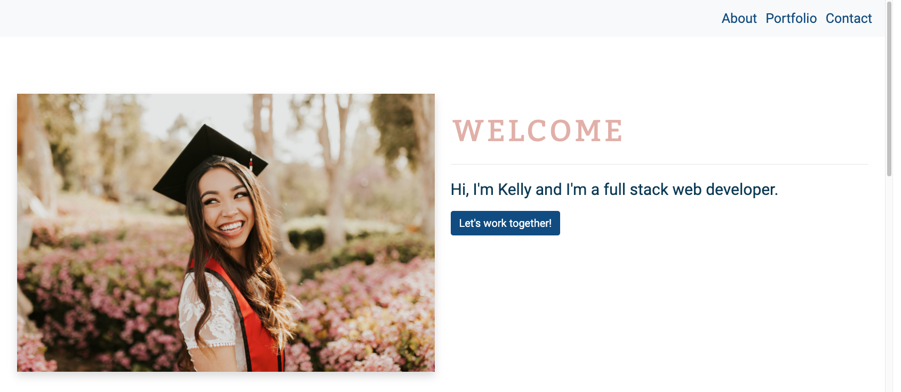
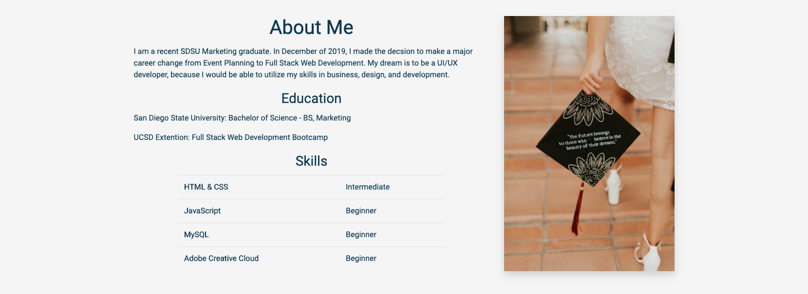
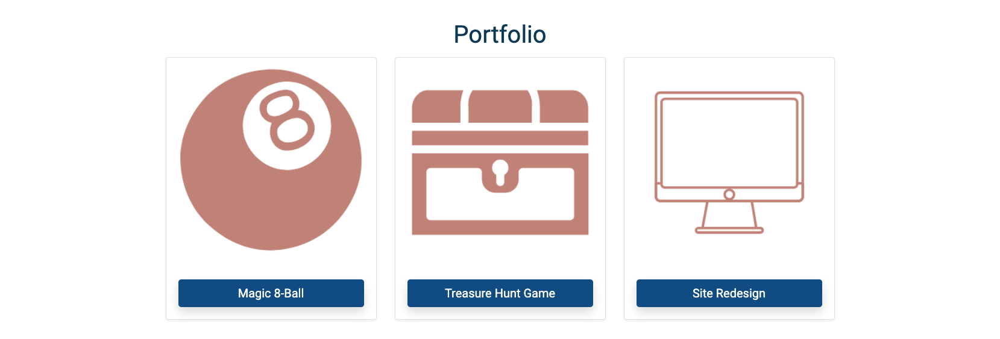
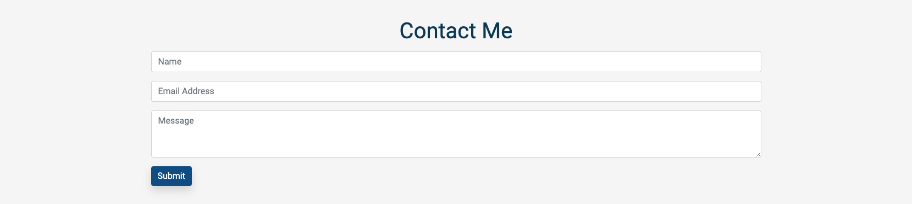

# Unit 02 CSS and Bootstrap Homework: Responsive Portfolio

Responsive design ensures that web applications render well on a variety of devices and window or screen sizes. As a developer, I will likely be asked to create a mobile-first application or add responsive design to an existing application. 

This project has been completed with no known bugs and can be viewed [here](https://kelly70ve.github.io/homework2/). The project is responsive and can be viewed on mobile, tablet or desktop. 

---

## Project Goals: 

* Using Bootstrap, develop a portfolio site with the following items:

   * A navbar

   * A responsive layout

   * Responsive images

* The Bootstrap portfolio should minimize the use of media queries.

* Use Bootstrap's grid system (containers, rows, and columns).

* On an `xs` screen, content should take up the entire screen. On `sm` and larger screens, it should have some margins on the left and right sides of the screen.

* Use an HTML validation service to ensure that each page has valid HTML. 
   * I used [Nu HTML Checker](https://validator.w3.org/)

* Navbar must be consistent on each page.

* Navbar on each page must contain links to Home/About, Contact, and Portfolio pages.

* All links must work.

* Must use semantic html.

* Must contain your personalized information. (bio, name, images, links to social media, etc.)

* Must properly utilize Bootstrap components and grid system.

---

## Project Sections

### Nav & Jumbotron

### About Me

### Portfolio

### Contact Me

### Footer with Social Links

--- 
## Technologies Used

- [HTML](https://developer.mozilla.org/en-US/docs/Web/HTML)
- [CSS](https://developer.mozilla.org/en-US/docs/Web/CSS)
- [Bootstrap](https://getbootstrap.com/)
- [Favicon.io](https://favicon.io/)
- [Font Awesome](https://fontawesome.com/)
- [FormSpree](https://formspree.io/)
- [Google Fonts](https://fonts.google.com/)
- [Canva](https://www.canva.com/)

- - -

© 2019 Trilogy Education Services, a 2U, Inc. brand. All Rights Reserved.
